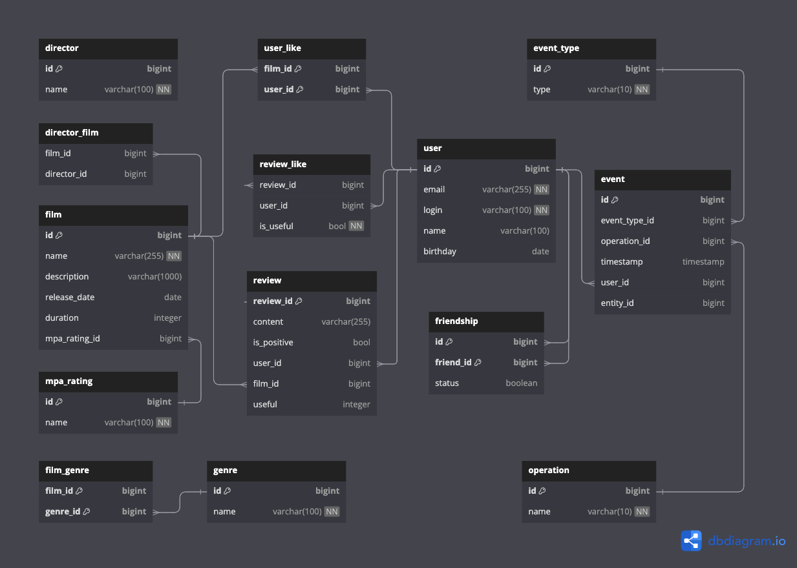

#  

1. [ER - diagram](#er-diagram)
2. [Table Description](#table-description)

## ER diagram

## Table Description

User

The `User` table stores information about the users of the Filmorate application.

| Column   | Type    | Constraints                       | Notes                 |
|----------|---------|-----------------------------------|-----------------------|
| id       | bigint  | PK                                | unique identification |   
| email    | varchar | not null, unique, max length: 255 | user email            |
| login    | varchar | not null, unique,max length: 100  | user login            |
| name     | varchar |                                   | user name             |
| birthday | date    | not null                          | user birthday         |

Friendship

The `Friendship` table captures the friendship relationships between users.

| Column    | Type    | Constraints      | Notes                                             |
|-----------|---------|------------------|---------------------------------------------------|
| id        | bigint  | PK, FK(users.id) | part of composite PK, references user ID          |   
| friend_id | bigint  | PK, FK(users.id) | part of composite PK, references friend's user ID |
| status    | bool    | default = false  | defines if friendship is confirmed                |

Film

The `Film` table holds information about the films available in the application.

| Column        | Type    | Constraints                        | Notes                           |
|---------------|---------|------------------------------------|---------------------------------|
| id            | bigint  | PK                                 | unique identification for films |   
| name          | varchar | not null, max length: 255          | film name                       |
| description   | varchar | null,max length: 200               | film description                |
| release_date  | date    | not null                           | film release date               |
| duration      | integer | not null, note: 'Must be positive' | film duration in minutes        |
| mpa_rating_id | bigint  | null, FK(mpa_ratings.id)           | references MPA rating ID        |

User_Like

The `User_Like` table represents the films liked by users. Certain User can "like" a certain film only once.

| Column  | Type   | Constraints      | Notes                                    |
|---------|--------|------------------|------------------------------------------|
| film_id | bigint | PK, FK(films.id) | part of composite PK, references film ID |
| user_id | bigint | PK, FK(users.id) | part of composite PK, references user ID | 

Film_Genre

The `Film_Genre` a junction table to establish a many-to-many relationship between films and genres.
Each film can be associated with multiple genres, and A single genre (from "Genre" table) can be associated with multiple films.

| Column   | Type   | Constraints       | Notes                                     |
|----------|--------|-------------------|-------------------------------------------|
| film_id  | bigint | PK, FK(films.id)  | part of composite PK, references film ID  |   
| genre_id | bigint | PK, FK(genres.id) | part of composite PK, references genre ID |

Genres

The `Genre` table lists the various genres that films can belong to.

| Column | Type    | Constraints                       | Notes                           |
|--------|---------|-----------------------------------|---------------------------------|
| id     | bigint  | PK                                | unique identification for genre |   
| name   | varchar | not null, unique, max length: 100 | genre name                      |

| id | name          |
|----|---------------|
| 1  | Comedy        |
| 2  | Drama         |
| 3  | Animation     |
| 4  | Thriller      |
| 5  | Documentary   |
| 6  | Action        |

Mpa_Ratings

The `Mpa_Rating` table contains the various Motion Picture Association (MPA) ratings
that can be assigned to films, indicating the appropriate age restrictions.
Each film can have one MPA rating, but each MPA rating can be associated with many films.

| Column | Type    | Constraints                       | Notes                            |
|--------|---------|-----------------------------------|----------------------------------|
| id     | bigint  | PK                                | unique identification for rating |   
| name   | varchar | not null, unique, max length: 100 | rating name                      |

| id | name  |                                               
|----|-------|
| 1  | G     |                                              
| 2  | PG    |                        
| 3  | PG-13 |                                  
| 4  | R     | 
| 5  | NC-17 |

Reviews

The `Reviews` table holds users personal reviews information about film.

| Column      | Type    | Constraints      | Notes                                    |
|-------------|---------|------------------|------------------------------------------|
| review_id   | bigint  | PK               | unique identification for reviews        |   
| content     | varchar | max length: 255  | reviews description                      |
| is_positive | boolean | not null         | film description                         |
| user_id     | bigint  | PK, FK(user.id)  | part of composite PK, references user ID |
| film_id     | bigint  | PK, FK(film.id)  | part of composite PK, references film ID |
| useful      | integer | default value: 0 | score useful review                      |

Review_Likes

The `Reviews_like` represents the reviews liked by users. The table contains 
field `is_useful` for definition useful score into `Reviews` table only once for 
each user with possibility change score useful.

| Column     | Type    | Constraints                | Notes                                              |
|------------|---------|----------------------------|----------------------------------------------------|
| review_id  | bigint  | PK, FK(reviews.review_id ) | part of composite PK, references reviews REVIEW_ID |
| user_id    | bigint  | PK, FK(users.id)           | part of composite PK, references user ID           | 
| is_useful  | boolean | not null                   | flag useful review affect on `useful` scope        |

Director

The `Director` table holds information about the director available in the application.

| Column    | Type    | Constraints                       | Notes                              |
|-----------|---------|-----------------------------------|------------------------------------|
| id        | bigint  | PK                                | unique identification for director |
| name      | varchar | not null, unique, max length: 100 | director name                      |

Director_Film

The Director_Film table represents the relationship between directors and films. 
It maps the association between a director and a film, indicating which films a director has worked on.

| Column      | Type    | Constraints          | Notes                                        |
|-------------|---------|----------------------|----------------------------------------------|
| director_id | bigint  | PK, FK(director.id ) | part of composite PK, references director ID |
| film_id     | bigint  | PK, FK(film.id)      | part of composite PK, references film ID     | 

Event

The Event table holds information about user activities on the platform, such as liking a film,
adding a friend, or writing a review.

| Column        | Type     | Constraints | Notes                                                                                       |
|---------------|----------|-------------|---------------------------------------------------------------------------------------------|
| id            | bigint   | PK          | unique identification for event                                                             |   
| event_type_id | bigint   | FK          | references the Event_Type table to indicate the type of event                               |
| operation_id  | bigint   | FK          | references the Operation table to indicate the operation performed                          |
| timestamp     | integer  |             | the time when the event occurred, stored as a Unix timestamp.                               |
| user_id       | bigint   | FK          | references the user who performed the event.                                                |
| entity_id     | bigint   | FK          | references the ID of the entity related to the event (e.g., film ID, review ID, friend ID). |

Event_Type

The Event_Type table holds information about the types of events that can occur on the platform, 
such as liking content, writing reviews, or managing friendships.

| Column | Type    | Constraints                      | Notes                                |
|--------|---------|----------------------------------|--------------------------------------|
| id     | bigint  | PK                               | unique identification for event type |
| type   | varchar | not null, unique, max length: 10 | The type of event                    |

| id | type   |                                               
|----|--------|
| 1  | LIKE   |                                              
| 2  | REVIEW |                        
| 3  | FRIEND |                                  

Operation

The Operation table holds information about the types of operations that can be performed on events, such as adding or removing a like, a review, or a friend.

| Column    | Type    | Constraints                      | Notes                               |
|-----------|---------|----------------------------------|-------------------------------------|
| id        | bigint  | PK                               | unique identification for operation |
| name      | varchar | not null, unique, max length: 10 | The name of the operation           |

| id | name   |                                               
|----|--------|
| 1  | REMOVE |                                              
| 2  | ADD    |                        
| 3  | PG-13  |                                  
| 4  | UPDATE | 
| 5  | NC-17  |

